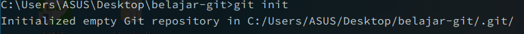
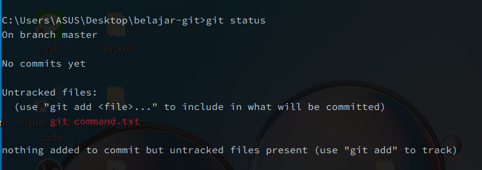
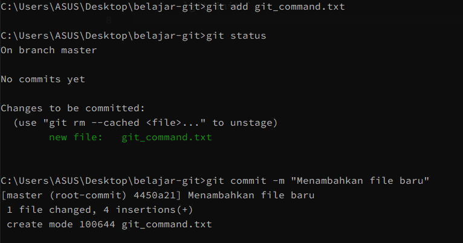
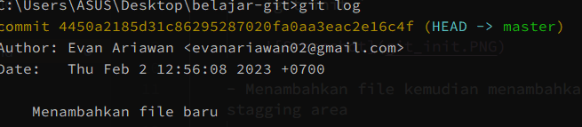

# Bekerja dengan Git

- ## Aktivitas
    - Mendownload Git dan mencobanya
    - Inisialisasi repo dengan

        `git init `

        

    - Menambahkan file kemudian menambahkannya ke stagging area

        ` git status `

        

        ` git add filename `

        ` git status `

        ` git commit -m "Message" `

        

    - Melihat perubahan yang terjadi pada repo kita

        ` git log `

        